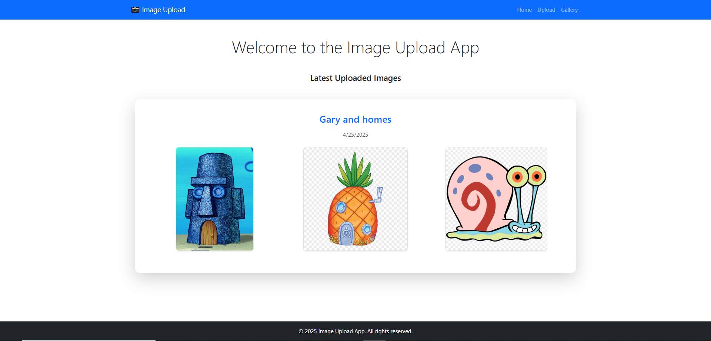
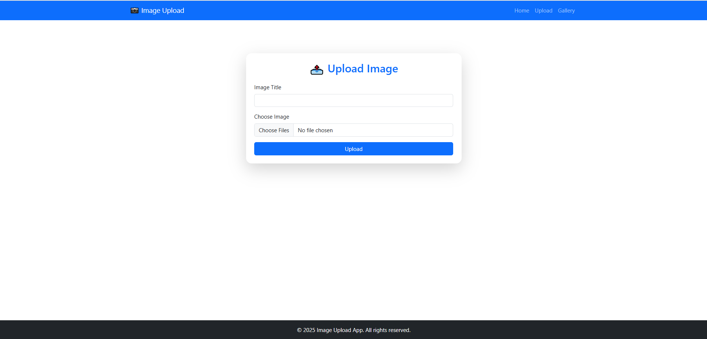
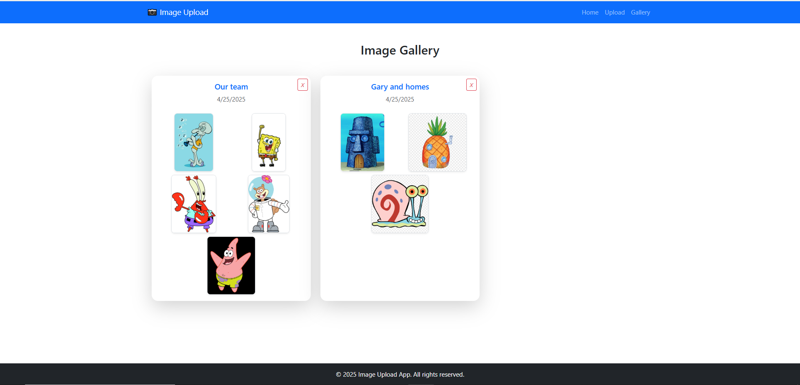

# 📸 Image Upload Web App

This is a simple web application that allows users to upload images with a title. The app displays the latest uploaded image on the homepage and shows all uploaded images in a gallery page. It is built using **Node.js**, **Express**, **Multer**, and **EJS**.

## 🚀 Features

- Upload an image or multiple image with a custom title
- Display the **latest uploaded image** with its **title and date** on the homepage
- Browse all uploaded images on the **Gallery page**
- File upload handled by **Multer**
- Views rendered using **EJS templates**

## 🛠️ Technologies Used

- Node.js
- Express.js
- Multer (for file uploads)
- EJS (for rendering views)
- HTML/CSS (for styling)

## 📂 Project Structure

## 💻 Installation

1. **Clone the repository:**
   ```
   git clone https://github.com/yourusername/image-upload-app.git
   cd image-upload-app
   

2. **Install dependencies:**
   ```
    npm install
3. **Run the server:**
    ```
     node index.js

4. **Open in browser:**
   ```
   http://localhost:3001
   
## 📷 Screenshots
   
   
   
